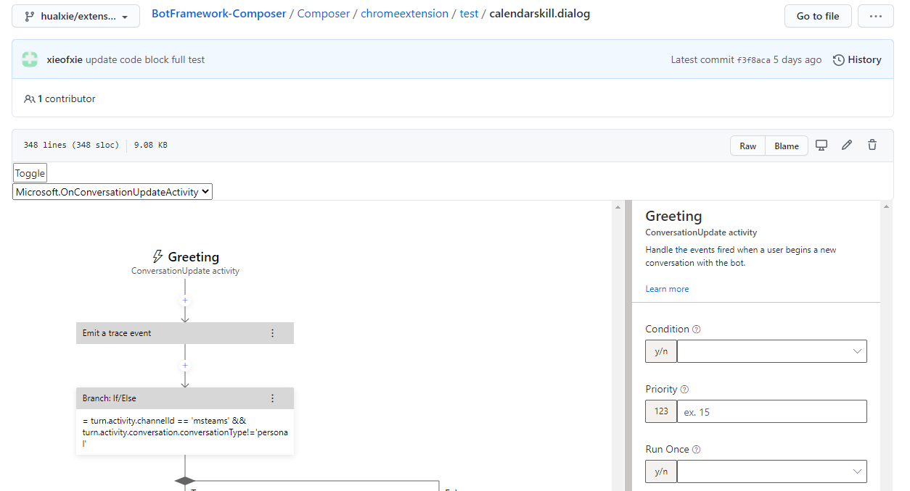
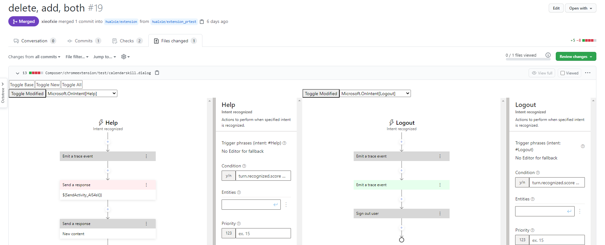
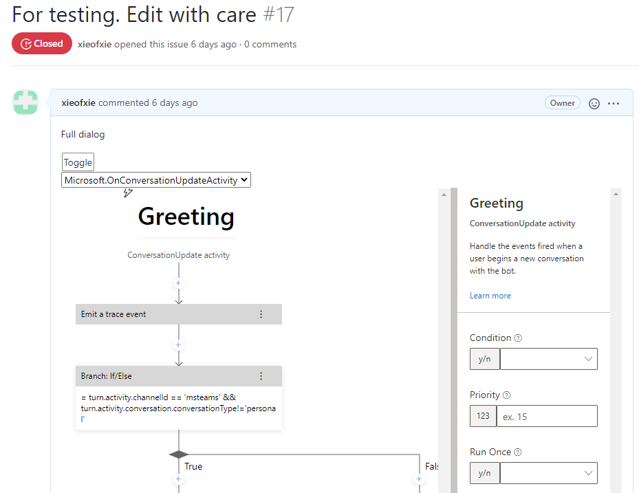
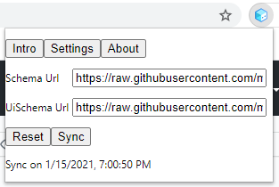

# Documentation

## Usage

### View dialog file

When viewing a [dialog file](https://github.com/xieofxie/BotFramework-Composer/blob/hualxie/extension/Composer/chromeextension/test/calendarskill.dialog), one could use the toggle button to switch between original file and Composer like visualization.

(As currenctly it does not monitor page change for this, when one navigates to a file within Github, toggle button will not show. Please refresh the page)

### View pull request

When viewing a [pull request](https://github.com/xieofxie/BotFramework-Composer/pull/19/files), one could use the toggle button to toggle base file, new file or show together.

Green nodes means added nodes, red nodes means deleted nodes and yellow nodes means with both addition and deletion.

(As currenctly it does not monitor page change for this, when one navigates to a pull request within Github, toggle button will not show. Please refresh the page)

### View code block

When viewing a [code block](https://github.com/xieofxie/BotFramework-Composer/issues/17) using language `declarative` , one could use the toggle button to switch between original file and Composer like visualization.

Only [one trigger](https://github.com/xieofxie/BotFramework-Composer/issues/26), [one action](https://github.com/xieofxie/BotFramework-Composer/issues/27) or [one action array](https://github.com/xieofxie/BotFramework-Composer/issues/28) is also supported.

## Configuration

Schema, UI schema's URL and content could be updated in the settings page.

